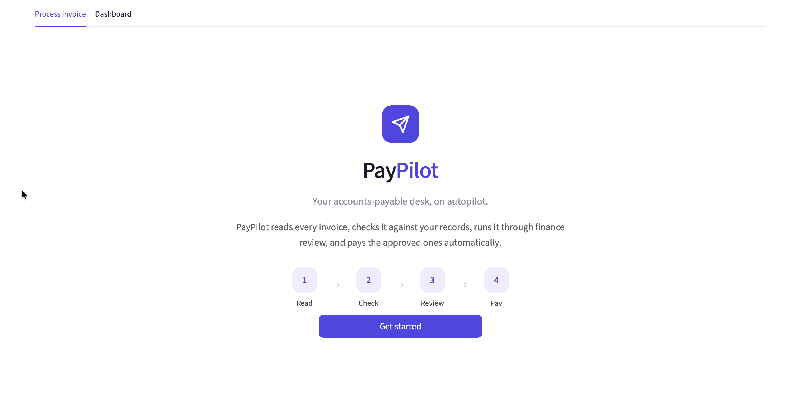
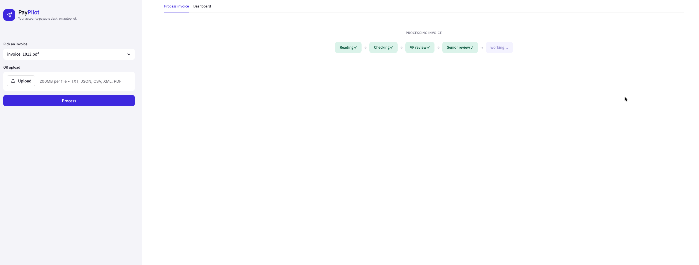
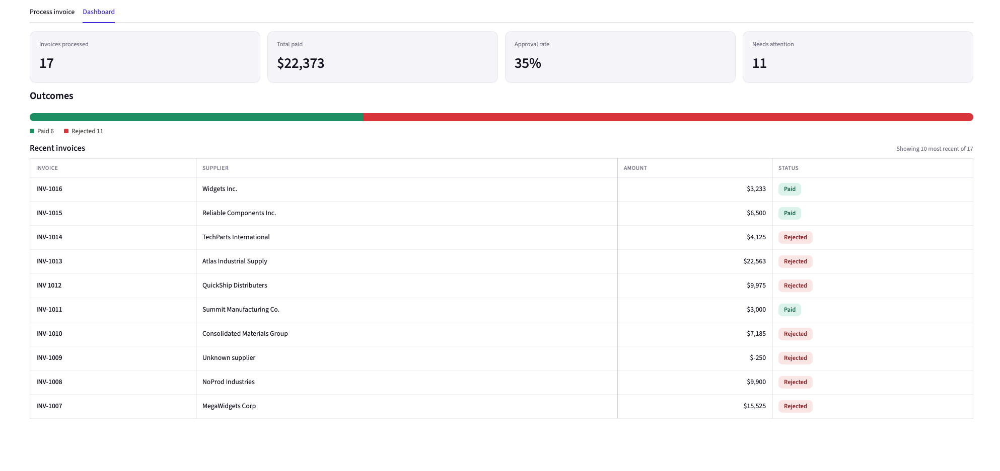

# PayPilot

*Your accounts-payable desk, on autopilot.*

A multi-agent accounts-payable system for **Acme Corp**. It ingests messy invoices
(PDF, JSON, CSV, XML, TXT), validates them against an inventory + vendor database,
reasons through approval like a finance team would, and pays the clean ones, all
locally, with a full audit trail behind every decision.

> Built for the Galatiq FDE take-home. The original brief lives in [REQUIREMENTS.md](REQUIREMENTS.md).

**The problem in one line:** Acme loses ~$2M/year to manual AP, a 30% error rate
and 5-day delays from staff hand-keying invoices, chasing VP sign-off over email,
and paying against an inconsistent legacy database.

---

## A note on approach

Before writing any code, I spoke with an experienced professional (my father) who has
spent over 15 years building and working with invoice-processing systems. That conversation grounded the design in
how AP actually runs day to day rather than in textbook assumptions. two decisions
came directly out of it:

- **A dedicated merchant table (an addition beyond the brief).** The assessment only
  specified an inventory table. I added a separate `master_merchants` table holding
  vendor rating, on-time history, and notes, because real systems keep merchant context
  as its own source of truth, independent of any single invoice. It is exactly what makes
  the Auditor Agent's merchant-history review possible.
- **The auditor as the critic.** Learning how high-value approvals get a second set of
  eyes from an independent auditor is what motivated building the critique agent *as* an
  Auditor Agent, rather than an abstract "reviewer."

---

## The core idea

> **Reasoning → the model. Correctness and money → deterministic code. The model never decides to pay.**

Most of an AP workflow is not a reasoning problem, it's arithmetic, lookups, and
policy. Those are wrong-answer-intolerant, so they run as plain Python against the
database. The model (Grok) is expensive and occasionally creative, so it's used
*only* where judgment genuinely helps:

| Stage | Who does it | Why |
|---|---|---|
| Extraction | **Grok** | Messy, typo-ridden text → structured fields needs language understanding |
| Validation | Deterministic | Math, stock, budget, duplicates, facts, not opinions |
| VP approval | **Grok** | Weighing *combinations* of flags is judgment |
| Auditor review | **Grok** | Independent critique of the VP on high-value invoices |
| Payment | Deterministic | Money moves only on a hard `approved` status |

Every stage writes a human-readable reason to an append-only audit log, so any
decision can be explained after the fact.

---

## Architecture


> **The dotted edge is a loop, not a straight line.** The auditor does not flow
> *forward* to a payment step. It hands its critique **back into the same VP node**,
> which re-decides with that critique injected. A `review_count` in the shared state,
> capped by `MAX_REVIEW_ROUNDS` (default **1**), bounds the loop so it runs at most once
> and can't ping-pong. That one counter is the whole difference between a genuine
> generator-critic loop and a flat sequential pipeline.

The whole thing is a **LangGraph state graph**. The graph owns *all* routing,
nodes never call each other directly. They're pure functions of
`(state) → state`; the conditional edges decide where the invoice goes next.

### The five stages

1. **Extraction (Grok).** Format is detected from the file extension and parsed
   (`pdfplumber` for PDFs, `pandas` for CSV, direct read for the rest). Grok then
   returns a **Pydantic-validated** `InvoiceExtraction` object via
   `with_structured_output`, the schema's field descriptions constrain the model
   and reject malformed output. The invoice, its line items, and the first audit
   row (`extracted`) are written to the DB.

2. **Validation (deterministic).** Produces *facts and flags, never decisions*:
   - Duplicate invoice number → immediate reject (this is what makes payment idempotent)
   - Unknown item / fuzzy-normalized match against the catalog
   - Unit-price mismatch vs. master
   - **Cumulative** stock & budget, sums already-approved spend/qty for that item
     (grouped within the invoice too) so the *running total* is what's checked
   - Line math, subtotal, and total arithmetic
   - Missing / unknown merchant
   - Sanity: negative quantities or amounts

3. **VP approval (Grok, always runs).** A ReAct agent with three tools
   (`get_merchant_details`, `get_item_details`, `get_invoice_history`). It
   investigates, weighs the *combination* of flags, and returns a JSON
   `{reasoning, decision}`. Under the $10K threshold it decides alone.

4. **Auditor review (Grok, only > $10K).** A **critic**, not a second approver.
   It re-examines the VP's reasoning with *more tools than the VP had*, including
   two it exclusively owns: `get_audit_trail` (the full decision history) and
   `get_spending_summary` (portfolio-level approved spend). This follows the
   **CRITIC pattern**: a critique only adds value if it's grounded in signals the
   generator couldn't see. It writes a structured critique and hands it back,
   it never approves or rejects itself.

5. **Payment (deterministic).** Fires only on a hard `approved` status. Calls
   `mock_payment(vendor, amount)`, records the `payment_txn_id`, and sets status
   to `paid`.

### The critique loop

For invoices over $10K, the graph runs **VP → Auditor → VP**. The VP makes an
initial call; the auditor critiques it using its extra tools; the critique is
injected back into the VP's prompt (with a note that it was escalated for crossing
the threshold) and the VP makes a **final, binding** decision. `MAX_REVIEW_ROUNDS`
(default 1) caps the loop so it can't ping-pong.

This is a true generator-critic reflection loop: the critic has *more* context, so
the second VP pass is measurably better-grounded (it starts citing prior-spend and
audit facts it had no way of knowing the first time).

---

## Data model

Five tables in SQLite, two seeded master tables and three populated by the pipeline.

- **`master_inventory`** - the catalog (item, unit price, annual budget, stock).
- **`master_merchants`**, known vendors (rating, on-time history, notes).
- **`transaction_invoices`** / **`transaction_invoice_items`**, what was extracted.
- **`transaction_audit_logs`**, append-only, one row per state change
  (`extracted → validated → … → paid`), each tagged with who acted and why.

**Master tables (seeded):**

| Table | Columns |
|---|---|
| `master_inventory` | `item_id` (PK), `item_name`, `unit_price`, `item_budget`, `stock_qty` |
| `master_merchants` | `merchant_id` (PK), `merchant_name`, `rating`, `on_time_history`, `notes` |

**Transaction tables (written by the pipeline):**

| Table | Columns |
|---|---|
| `transaction_invoices` | `trn_id` (PK), `invoice_number`, `merchant_name`, `invoice_date`, `due_date`, `subtotal`, `tax`, `total`, `currency`, `source_file` |
| `transaction_invoice_items` | `invoice_transaction_id` (PK), `trn_id` (FK), `item_name`, `quantity`, `unit_price`, `line_total` |
| `transaction_audit_logs` | `audit_log_id` (PK), `trn_id` (FK), `status`, `review_note`, `reviewed_by`, `payment_txn_id`, `updated_at` |

**A deliberate design signal:** known-bad actors (`Fraudster LLC`, `NoProd
Industries`, empty-vendor invoices, `FakeItem`) are *intentionally absent* from the
master tables. "Not in the catalog" *is* the risk signal, the system treats an
unknown vendor or item as something to flag, exactly as a real AP team would.

Full schema is the source of truth in [`db/models.py`](db/models.py); seed data in
[`data/seed/`](data/seed/).

---

## Quickstart

```bash
make setup                                   # create venv, install deps, build + seed the DB
echo "XAI_API_KEY=your_key_here" > .env      # add your xAI key
make run                                     # launch the PayPilot dashboard
```

That's it — three commands and the app opens in your browser. Run `make` on its
own to list everything:

| Command | What it does |
|---|---|
| `make setup` | One-time setup on a fresh clone: venv + install + seed |
| `make run` | Launch the Streamlit dashboard |
| `make cli INVOICE=data/invoices/invoice_1005.json` | Process one invoice from the command line |
| `make seed` | Wipe and rebuild the database (inventory + merchants) |
| `make clean` | Delete the local database |

The CLI path (`make cli`) prints structured logs — every tool call, each agent's
reasoning, and the final decision — alongside the full audit trail in
`transaction_audit_logs`.

<details>
<summary>No <code>make</code>? The manual steps</summary>

```bash
python3.11 -m venv invoice_agent_env && source invoice_agent_env/bin/activate
pip install -r requirements.txt
alembic upgrade head && python migrations/seed.py    # build + seed the database
echo "XAI_API_KEY=your_key_here" > .env
streamlit run app.py                                 # or: python main.py --invoice_path=<file>
```
</details>

---

## UI/UX

**PayPilot** is the operator-facing dashboard (Streamlit). It's designed for a
finance person with *no* technical knowledge: they see the *thinking* and the
*verdict*, never the plumbing. No tool names, no table names, no JSON — just plain
business language end to end.

### The starter page



A centered welcome: the PayPilot mark, a one-line description, a `Read → Check →
Review → Pay` strip that previews the pipeline, and a single **Get started**
button. Clicking it opens the workspace (controls move to the sidebar).

### Processing an invoice — watch it think



Pick a sample invoice (or upload your own) in the sidebar and press **Process**.
The pipeline then **streams live** — a chain builds itself stage by stage as each
agent finishes:

> `Reading ✓ → Checking ✓ → VP review ✓ → Senior review ✓ → Payment`

This is driven straight off the LangGraph run (`graph.stream(stream_mode="updates")`),
so the UI reflects the real pipeline, not a canned animation. When it finishes, it
resolves into:

- an **invoice card** with the key facts and a **verdict pill** (Approved / Paid /
  Rejected / On hold) at a glance, and
- the full **pipeline timeline** below it — one connected flow (not loose boxes),
  each step showing *who acted* (Reading, Automated checks, VP of Finance, Senior
  Auditor, Payment), a plain-language note, and any flags. The VP → Auditor → VP
  critique loop renders as the auditor's review **indented under** the VP, so the
  reflection loop is something you can *see*.

### Plain language, always

Two layers keep it readable for a non-technical user:

- **A translation layer** turns every deterministic flag into finance English:

  | Internal | What the user sees |
  |---|---|
  | `price_mismatch: WidgetB (invoice=560, master=500)` | "Price differs from agreed — WidgetB billed at $560/unit vs our $500 ($60 over)" |
  | `unknown_merchant` | "Supplier not approved" |
  | `stock_exceeded` | "Order larger than available stock" |
  | `master_inventory` / `master_merchants` | "product catalog" / "approved supplier list" |

- **The agent prompts** are tuned so the VP and auditor write their reasoning in
  plain business terms — addressed to the reader, never mentioning tools or tables.

### One source of truth

Everything on screen is reconstructed from `transaction_audit_logs` — the same
append-only audit trail that records each decision also drives the UI. The live
run and a later replay from the dashboard render from the identical source, so what
you see is always exactly what was logged.

### The dashboard



A summary view across every processed invoice: KPI cards (invoices processed, total
paid, approval rate, needs-attention), an outcomes bar, and a recent-invoices table.

### Design

A clean fintech aesthetic — Inter type, a single indigo accent, card-based layout,
generous whitespace — deliberately *not* the default Streamlit look. The theme lives
in [`.streamlit/config.toml`](.streamlit/config.toml) plus a small CSS layer in
[`ui/render.py`](ui/render.py); the view layer (`ui/`) is kept separate from the
pipeline so the two evolve independently.

---

## Assumptions & scope

- **Local & offline.** No external APIs; payment is mocked. Matches the brief's
  "assume no internet" constraint.
- **Foreign currency is held, not guessed (deliberate choice).** The master catalog
  is USD. A non-USD invoice (e.g. INV-1014 in EUR) can't be price- or budget-checked
  against it without an FX rate, and converting with a stale offline rate would mean
  paying a *guessed* amount — exactly what "money → deterministic, never guess" forbids.
  So validation flags `foreign_currency`, skips only the two cross-currency checks
  (everything else — line math, totals, stock — still runs), and the invoice ends in a
  third terminal status, **`fx_review_hold`** — a "good but one thing unverified" outcome,
  distinct from rejected. A deterministic guard ensures it can never be paid regardless of
  what the model says. **If an external FX API were permitted**, the cleaner path is to
  convert to USD *inside validation before the checks run* — then the price/budget checks
  and approval flow work unchanged, with no separate hold needed.
- **Budget = annual spend cap per item**, checked cumulatively against
  already-approved invoices.
- **Idempotency via duplicate detection.** A repeated invoice number is rejected at
  validation, which is what prevents double payment.
- **The threshold ($10K) and review-round cap are config**, not hard-coded,
  changing AP policy is a one-line edit in [`config.py`](config.py).
- **The model is swappable.** Grok lives behind [`llm.py`](llm.py); switching
  providers is a single-file change.

---

## Design decisions worth calling out

- **Graph owns routing, nodes stay pure.** Threshold checks, loop counters, and
  escalation all live in the graph's edges, not buried inside node functions.
  This keeps each stage independently testable and the control flow in one place.
- **The critic is strictly a critic.** The auditor returns reasoning, never a
  verdict. This removed a real ambiguity (does "approved" mean *I approve the
  invoice* or *I approve the VP's logic?*) and keeps the VP as the single
  decision-maker.
- **The critic is given more than the generator.** Without that, a reflection loop
  is just a model agreeing with itself.
- **Deterministic core, narrow model surface.** The model touches three of five
  stages and *never* the money, which is exactly the property you want auditors
  and a CFO to be comfortable with.
- **The VP runs even on a perfectly clean invoice.** Zero validation flags does not
  mean auto-approve. The VP still checks that the merchant is real, well-rated, and has
  no history of problems before clearing payment. A clean *invoice* from a bad *vendor*
  is still a bad payment, and only the VP looks at the vendor.
- **Stock and budget are checked cumulatively, across and within invoices.** Comparing
  one invoice's quantity against master stock is not enough. Ten invoices can each be
  under stock on their own yet blow past it together. So for every item we add up
  (a) the quantity already **approved** on *other* invoices and (b) the quantity on the
  **current** invoice, where the same item can appear on several line items, so we group
  those lines and sum them first. The combined total is what gets checked against stock,
  and the identical pattern is used for the annual budget. This catches both the
  across-invoice and within-invoice ways a limit gets quietly exceeded.
