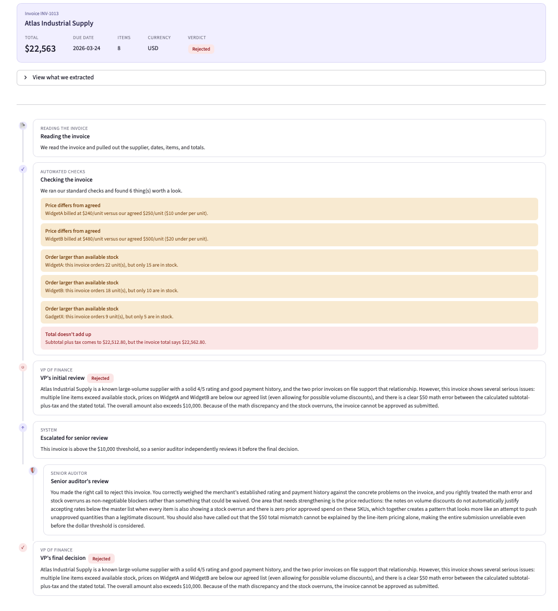
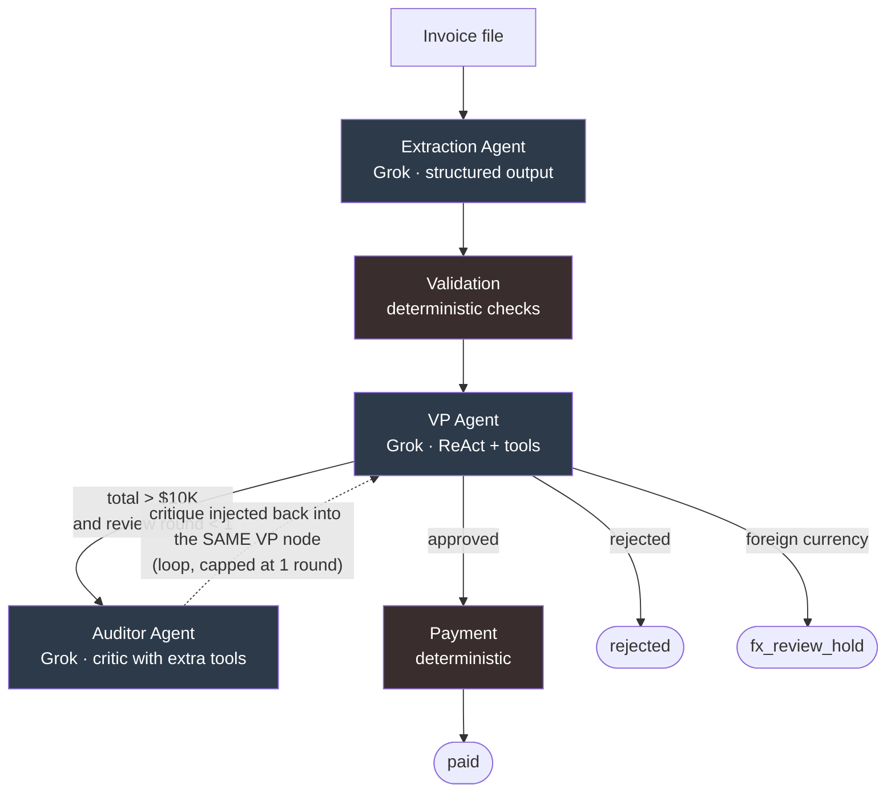

# PayPilot

*Your accounts-payable desk, on autopilot.*

A multi-agent accounts-payable system for **Acme Corp**. It ingests messy invoices
(PDF, JSON, CSV, XML, TXT), validates them against an inventory and vendor database,
reasons through approval like a finance team would, and pays the clean ones.
Everything runs locally, with a full audit trail behind every decision.

> Built for the Galatiq FDE take-home. The original brief is in [REQUIREMENTS.md](REQUIREMENTS.md).

**The problem in one line:** Acme loses about $2M a year to manual AP, a 30% error
rate and 5-day delays, from staff hand-keying invoices, chasing VP sign-off over
email, and paying against an inconsistent legacy database.

---

## Quickstart

```bash
make setup                                   # create venv, install deps, build + seed the DB
echo "XAI_API_KEY=your_key_here" > .env      # add your xAI key
make run                                     # launch the PayPilot dashboard
```

Three commands and the app opens in your browser. Run `make` on its own to list
everything:

| Command | What it does |
|---|---|
| `make setup` | One-time setup on a fresh clone: venv + install + seed |
| `make run` | Launch the Streamlit dashboard |
| `make cli INVOICE=data/invoices/invoice_1005.json` | Process one invoice from the command line |
| `make seed` | Wipe and rebuild the database (inventory + merchants) |
| `make test` | Run the unit tests |
| `make lint` | Lint with ruff |
| `make format` | Format the code with ruff |
| `make clean` | Delete the local database |

The CLI path (`make cli`) prints structured logs (every tool call, each agent's
reasoning, and the final decision) alongside the full audit trail in
`transaction_audit_logs`.

<details>
<summary>No <code>make</code>? The manual steps</summary>

```bash
python -m venv invoice_agent_env && source invoice_agent_env/bin/activate
pip install -r requirements.txt
alembic upgrade head && python migrations/seed.py    # build + seed the database
echo XAI_API_KEY=your_key_here > .env
streamlit run app.py                                 # or: python main.py --invoice_path=<file>
```
</details>

---

## UI/UX

**PayPilot** is the operator-facing dashboard (Streamlit)

### The starter page


A centered welcome: the PayPilot mark, a one-line description, a `Read, Check,
Review, Pay` strip that previews the pipeline, and a single **Get started** button.
It opens the workspace, with the controls in the sidebar.

### Processing an invoice, watch it think


Pick a sample invoice from data/invoices folder (or upload your own) and press **Process**. The pipeline then
streams live, a chain that builds itself stage by stage as each agent finishes:

> `Reading -> Checking -> VP review -> Senior review -> Payment`

This is driven straight off the LangGraph run (`graph.stream(stream_mode="updates")`),
so the UI reflects the real pipeline, not a canned animation. When it finishes, it
resolves into:



- an **invoice card** with the key facts and a **verdict pill** (Approved, Paid,
  Rejected, On hold) at a glance, and
- the full **pipeline timeline** below it. Each step shows who acted (Reading, Automated checks, VP of Finance, Senior
  Auditor, Payment), a plain-language note, and any flags. The VP, Auditor, VP
  critique loop renders as the auditor's review indented under the VP, so the
  reflection loop is something you can see.

Example of an effective Critique review:


### The dashboard


A summary across every processed invoice: KPI cards (invoices processed, total paid,
approval rate, needs-attention), an outcomes bar, and a recent-invoices table.

---

## The core idea

> **Reasoning goes to the model. Correctness and money stay in deterministic code.
> The model never decides to pay.**

Most of an AP workflow is not a reasoning problem, it is arithmetic, lookups, and
policy. Those are intolerant of wrong answers, so they run as plain Python against
the database. Grok is expensive and occasionally creative, so it is used *only*
where judgment genuinely helps:

| Stage | Who does it | Why |
|---|---|---|
| Extraction | **Grok** | Messy, typo-ridden text into structured fields needs language understanding |
| Validation | Deterministic | Math, stock, budget, duplicates: facts, not opinions |
| VP approval | **Grok** | Weighing *combinations* of flags is judgment |
| Auditor review | **Grok** | Independent critique of the VP on high-value invoices |
| Payment | Deterministic | Money moves only on a hard `approved` status |

Every stage writes a human-readable reason to an append-only audit log, so any
decision can be explained after the fact.

---

## Architecture



> **The dotted edge is a loop, not a straight line.** The auditor does not flow
> forward to payment. It hands its critique back into the same VP node, which
> re-decides with that critique in hand. A `review_count` in shared state, capped by
> `MAX_REVIEW_ROUNDS` (default 1), bounds the loop so it runs at most once and cannot
> ping-pong. That one counter is the whole difference between a real generator-critic
> loop and a flat pipeline.

The whole system is a **LangGraph state graph**. The graph owns all routing; nodes
never call each other. They are pure functions of `(state) -> state`, and the
conditional edges decide where each invoice goes next.

### The five stages

1. **Extraction (Grok).** Format is detected from the file extension and parsed
   (`pdfplumber` for PDFs, `pandas` for CSV, direct read for the rest). Grok returns
   a Pydantic-validated `InvoiceExtraction` object via `with_structured_output`, with
   a bounded self-correcting retry loop on malformed output. The invoice, its line
   items, and the first audit row (`extracted`) are written to the DB.

2. **Validation (deterministic).** Produces facts and flags, never decisions:
   - Duplicate invoice number, immediate reject (this is what makes payment idempotent)
   - Unknown item, or fuzzy-normalized match against the catalog
   - Unit-price mismatch vs. master
   - Cumulative stock and budget: already-approved spend and quantity for the item are
     summed (grouped within the invoice too), so the running total is what gets checked
   - Line math, subtotal, and total arithmetic
   - Missing or unknown merchant
   - Sanity: negative quantities or amounts

3. **VP approval (Grok, always runs).** A ReAct agent with three tools
   (`get_merchant_details`, `get_item_details`, `get_invoice_history`). It
   investigates, weighs the combination of flags, and returns JSON
   `{reasoning, decision}`. Under the $10K threshold it decides alone.

4. **Auditor review (Grok, only above $10K).** A critic, not a second approver. It
   re-examines the VP's reasoning with more tools than the VP had, including two it
   alone owns: `get_audit_trail` and `get_spending_summary` (portfolio-level approved
   spend). This follows the CRITIC pattern: a critique only adds value if it is
   grounded in signals the generator could not see. It writes a critique and hands it
   back; it never approves or rejects.

5. **Payment (deterministic).** Fires only on a hard `approved` status. Calls
   `mock_payment(vendor, amount)`, records the `payment_txn_id`, and sets status to
   `paid`.

---

## Data model

Five tables in SQLite: two seeded master tables, three populated by the pipeline.
The audit log is append-only, one row per state change (from `extracted` through
`validated` to `paid`), each tagged with who acted and why.

**Master tables (seeded):**

| Table | Columns |
|---|---|
| `master_inventory` | `item_id` (PK), `item_name`, `unit_price`, `item_budget`, `stock_qty` |
| `master_merchants` | `merchant_id` (PK), `merchant_name`, `rating`, `on_time_history`, `notes` |

**Transaction tables (written by the pipeline):**

| Table | Columns |
|---|---|
| `transaction_invoices` | `trn_id` (PK), `invoice_number`, `merchant_name`, `invoice_date`, `due_date`, `subtotal`, `tax`, `total`, `currency`, `source_file` |
| `transaction_invoice_items` | `invoice_transaction_id` (PK), `trn_id` (FK), `item_name`, `quantity`, `unit_price`, `line_total` |
| `transaction_audit_logs` | `audit_log_id` (PK), `trn_id` (FK), `status`, `review_note`, `reviewed_by`, `payment_txn_id`, `updated_at` |

**A deliberate design signal:** known-bad actors (`Fraudster LLC`, `NoProd
Industries`, empty-vendor invoices, `FakeItem`) are intentionally absent from the
master tables. "Not in the catalog" *is* the risk signal: the system treats an
unknown vendor or item as something to flag, exactly as a real AP team would.

Full schema is the source of truth in [`db/models.py`](db/models.py); seed data in
[`data/seed/`](data/seed/).

---

## Testing

The deterministic core is unit-tested with pytest (`make test`). Validation is the
money-critical logic and is pure, so the suite in [`tests/`](tests/) covers it
directly: clean invoices, stock and budget overruns, unknown item and vendor, math
errors, foreign currency, duplicate rejection, and cumulative limits across invoices.
These map one to one onto the scenarios in the brief.

The code is linted and formatted with ruff (`make lint`, `make format`).

---

## Assumptions & scope

- **Local and offline.** No external APIs, payment is mocked. Matches the brief's
  "assume no internet" constraint.
- **Foreign currency is held, not guessed.** The catalog is USD, so a non-USD invoice
  (e.g. INV-1014 in EUR) cannot be price- or budget-checked without an FX rate, and
  converting with a stale offline rate would mean paying a guessed amount, which the
  "money is deterministic, never guess" rule forbids. So validation flags
  `foreign_currency`, skips only the two cross-currency checks (line math, totals, and
  stock still run), and the invoice lands in a third terminal status,
  `fx_review_hold`, distinct from rejected. A deterministic guard ensures it can never
  be paid. With an FX API allowed, the cleaner path is to convert to USD inside
  validation before the checks run.
- **Budget is an annual spend cap per item**, checked cumulatively against
  already-approved invoices.
- **Idempotency via duplicate detection.** A repeated invoice number is rejected at
  validation, which prevents double payment.
- **Threshold ($10K) and review-round cap are config**, not hard-coded. Changing AP
  policy is a one-line edit in [`config.py`](config.py).
- **The model is swappable.** Grok lives behind [`llm.py`](llm.py), so switching
  providers is a single-file change.

---

## Design decisions worth calling out

- **Graph owns routing, nodes stay pure.** Threshold checks, loop counters, and
  escalation live in the graph's edges, not inside node functions. Each stage stays
  independently testable and the control flow lives in one place.
- **The critic is strictly a critic.** The auditor returns reasoning, never a verdict.
  This removes a real ambiguity (does "approved" mean the invoice or the VP's logic?)
  and keeps the VP as the single decision-maker.
- **The critic gets more than the generator.** Without that, a reflection loop is just
  a model agreeing with itself.
- **Deterministic core, narrow model surface.** The model touches three of five stages
  and never the money, which is exactly the property you want a CFO and auditors
  comfortable with.
- **The VP runs even on a clean invoice.** Zero flags does not mean auto-approve. The
  VP still checks the merchant is real, well-rated, and problem-free, because a clean
  invoice from a bad vendor is still a bad payment, and only the VP looks at the vendor.
- **Stock and budget are checked cumulatively.** One invoice against master stock is
  not enough, since ten invoices can each be under stock alone yet exceed it together.
  For each item we add the already-approved quantity on other invoices to the quantity
  on the current one (grouping repeated line items first) and check the combined total,
  using the same pattern for the annual budget. This catches both the across-invoice
  and within-invoice ways a limit gets quietly exceeded.
